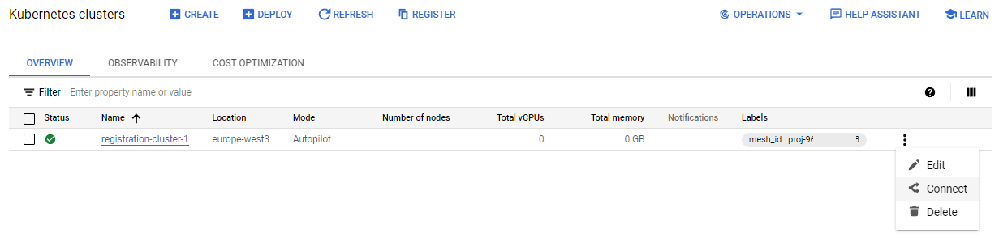
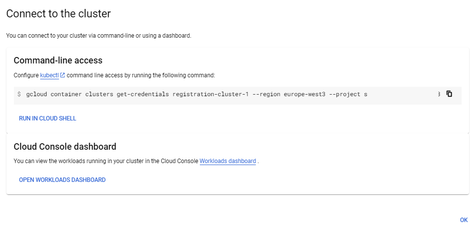
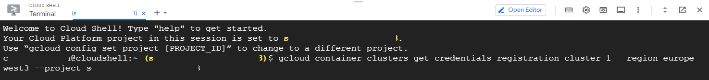
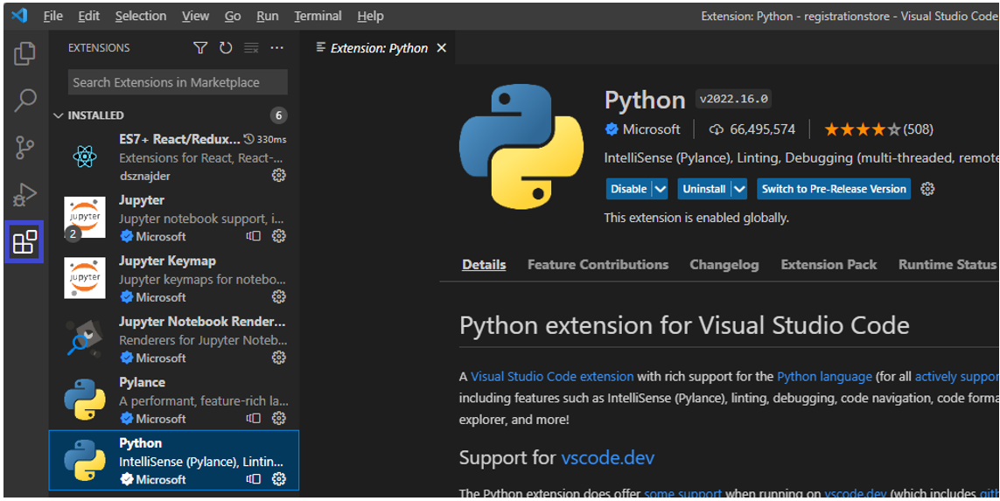
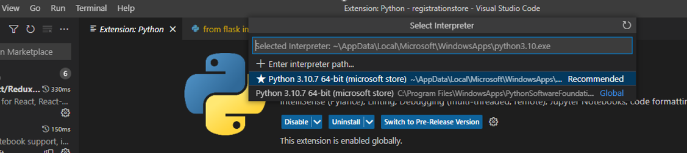
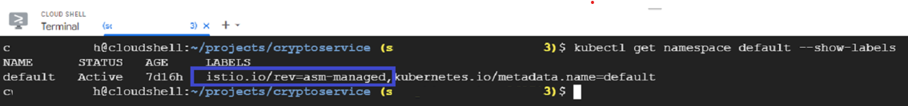

# 0. Registration Application Service Mesh Set-up

Base instructions and initial scripts to create and configure a simple Microservice Mesh in Kubernetes Engine (GCloud)

This section explains development tools, Kubernetes Engine and Anthos Service Mesh set-up

## 0.1 Google Cloud Project & Kubernetes cluster creation

### 0.1.1 Connect to GKE (Kubernetes Engine) context in GCloud (Google Cloud):

### 0.1.2 Connect to the K8s cluster

### 0.1.3 Establish the Service Accounts

Creates a new K8s service account impersonating a new Google IAM service account (used by services to securely access secrets during their start-up)

Replace [PROJECT_ID] with your project in the following script before running it in GCloud:

[Service Accounts set-up script](https://github.com/burningglass/registrationservicemeshsetup/blob/main/createAndPermissionServiceMeshAccounts.sh)

## 0.2 Install GIT for Windows

[In Windows] https://gitforwindows.org/
[In MacOS] https://git-scm.com/download/mac (i.e. install Homebrew (https://brew.sh/), then:  brew install git)

## 0.3 Install Developer Tools

### 0.3.1 Visual Studio Code installation

Install from here:

[VS Code download](https://code.visualstudio.com/download)

### 0.3.2 Install Python Intellisense

### 0.3.3 Separately Install Python Runtime

Install from here:

[Python download](https://www.python.org/downloads/)

Now from VS Code Terminal (or a Command Prompt) check Python is executable on the user PATH:

| Application | Typical Location |
| ----------- | ----------- |
| python | c:\users\uname\AppData\Local\Microsoft\WindowsApps |
| pip | c:\users\uname\AppData\Local\Microsoft\WindowsApps |

Type 'python' on the Command Prompt to check the version, e.g. 3.10.7
`python`
`quit()`

### 0.3.4 Convigure VS Code to use the Python Interpreter

In VS Code:

1. Select: View > Command Palette
2. Search for: Python: Select Interpreter

### 0.3.5 Separately Install Node.js

Install from here:

[Node.js install](https://nodejs.org/en/download/)

Install 64bit if possible

Issue these Command Prompt commands to check Node.js installed correctly:

`node -v` (or `node -version`) ...e.g. reveals v16.3.0
`node -p "process.arch"` ...e.g. reveals x64
