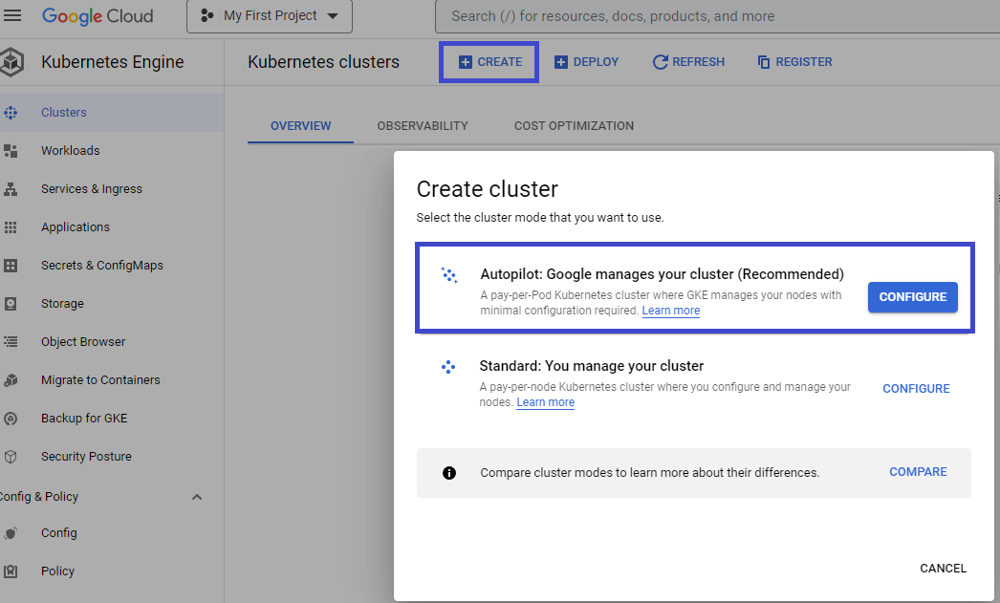
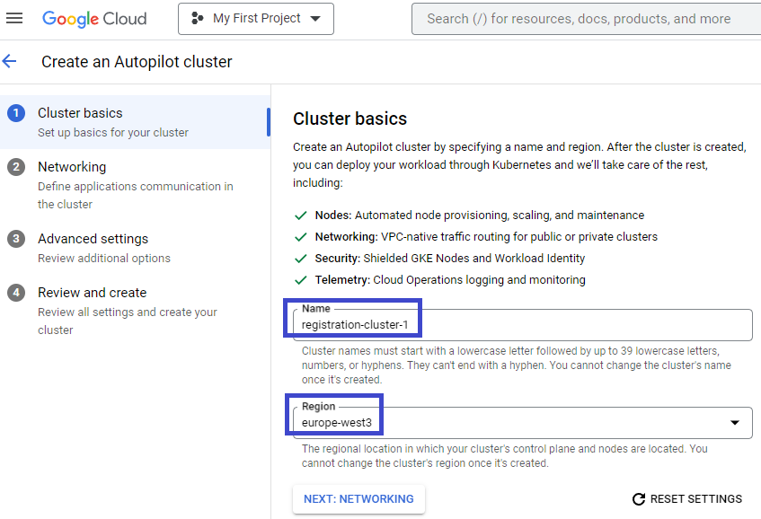
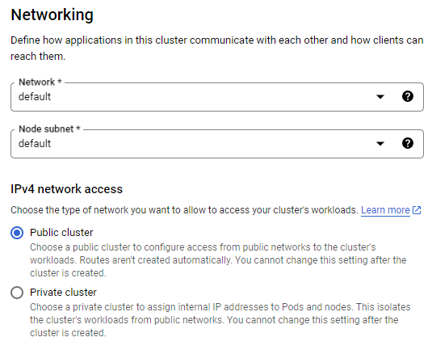
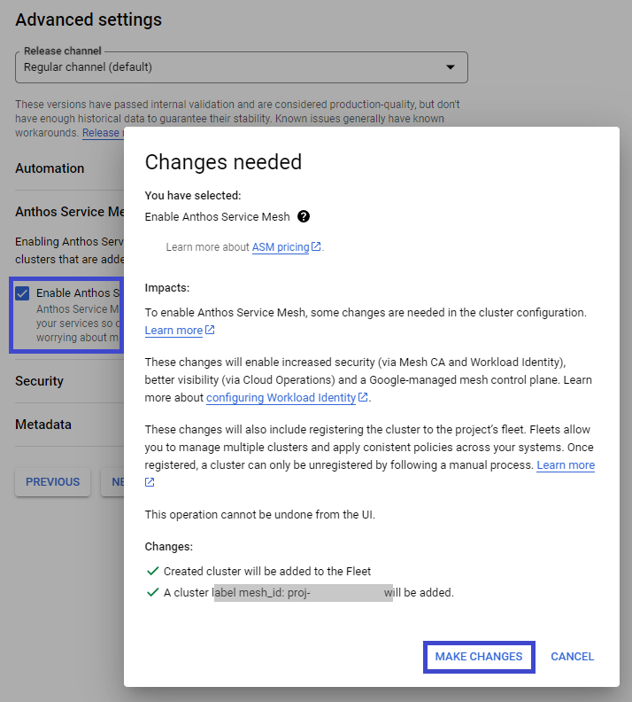
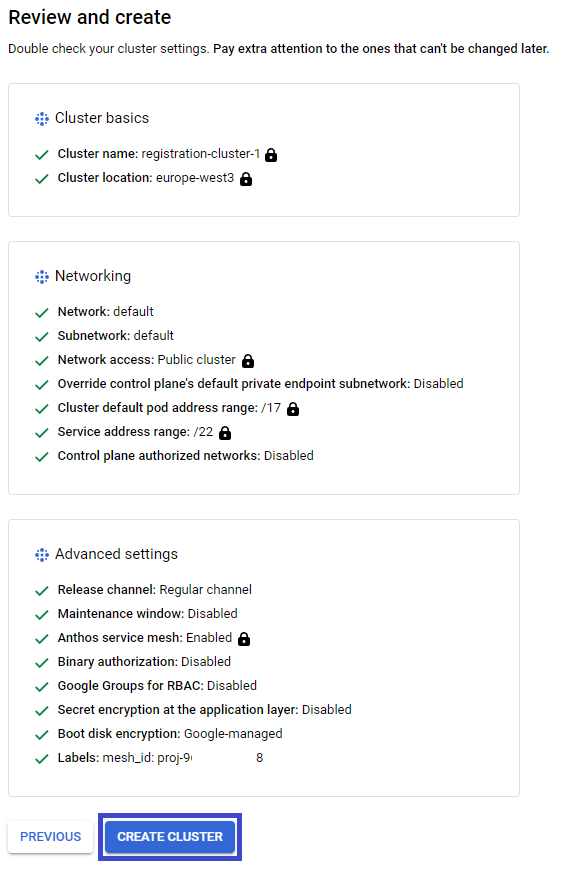

# Registration Application Service Mesh Set-up

Base instructions and initial scripts to create and configure a simple service mesh in Kubernetes Engine (GCloud)

This section explains K8s (Kubernetes) Engine Cluster, Service Account and Anthos Service Mesh configuration as well as installation of development tools

## 1 K8s Cluster Creation (in GCloud)

### 1.1 Create the cluster

Under Kubernetes Engine, create a new Autopilot cluster:

### 1.2 Cluster Basics

Enter the fundamental information (choose you cluster name and hosting region):

### 1.3 Cluster Visibility

Ensure visibility of the cluster to external networks (service endpoints must be Internet-reachable):

### 1.4 Include Anthos(Istio) Support Mesh support

Cluster must include Anthos support:

### 1.5 Finalise set-up

Review and Create the new K8s cluster:

## 2 Service Accounts Creation

### 2.1 Connect to GKE (Kubernetes Engine) context in GCloud (Google Cloud):

### 2.2 Connect to the K8s cluster

### 2.3 Establish the Service Accounts

Creates a new K8s service account impersonating a new Google IAM service account (used by services to securely access secrets during their start-up)

Replace [PROJECT_ID] with your project in the following script before running it in GCloud:

[Service Accounts set-up script](https://github.com/burningglass/registrationservicemeshsetup/blob/main/createAndPermissionServiceMeshAccounts.sh)

## 3 Enable the Anthos(Istio) Service Mesh

### 3.1 Verify Anthos support was pre-integrated into the cluster

`kubectl describe controlplanerevision asm-managed -n istio-system`

i.e. Google's asmcli already created the ControlPlaneRevision custom resource in the cluster

### 3.2 Inject sidecar proxies with Anthos Service Mesh

The following will reveal the name (e.g. 'asm-managed') which will be used for REVISION (next step):

`kubectl -n istio-system get controlplanerevision`

### 3.3 Add the Istio label to the GCloud K8s namespace:

`kubectl label namespace NAMESPACE istio-injection- istio.io/rev=REVISION --overwrite`

e.g.

`kubectl label namespace default istio-injection- istio.io/rev=asm-managed --overwrite`

The following command should reveal the additional label now assigned to this K8s namespace:

`kubectl get namespace default --show-labels`

i.e.

## 4 Install GIT for Windows

- [In Windows] https://gitforwindows.org/
- [In MacOS] https://git-scm.com/download/mac (i.e. install Homebrew (https://brew.sh/), then:  brew install git)

## 5 Install Developer Tools

### 5.1 Visual Studio Code installation

Install from here:

[VS Code download](https://code.visualstudio.com/download)

### 5.2 Terminal usage

The VS Code Terminal is available from the main menu in Windows, but in MacOS, you should activate it using the keyboard command: `⌘+`(backtick)`

Better in MacOS is to install a first class alternative like iTerm2:

[Terminal software for MacOS](https://https://iterm2.com/)

iTerm2 commands:
- ⌘+D:		Vertifical window split
- ⌘+Shift+D:	Horizontal window split
- ⌘+[:		Switch to previous window pane
- ⌘+]:		Switch to next window pane
- ⌘+Shift+T:	New tab
- ⌘+Shift+[:	Switch to previous tab
- ⌘+Shift+]:	Switch to next tab

### 5.3 Install Python Intellisense

### 5.4 Separately Install Python Runtime

Install from here:

[Python download](https://www.python.org/downloads/)

Now from VS Code Terminal (or a Command Prompt) check Python is executable on the user PATH:

| Application | Typical Location |
| ----------- | ----------- |
| python | c:\users\uname\AppData\Local\Microsoft\WindowsApps |
| pip | c:\users\uname\AppData\Local\Microsoft\WindowsApps |

Type 'python' on the Command Prompt to check the version, e.g. 3.10.7:

`python` 
`quit()`

### 5.5 Configure VS Code to use the Python Interpreter

In VS Code:

1. Select: View > Command Palette
2. Search for: Python: Select Interpreter

### 5.6 Separately Install Node.js

Install from here:

[Node.js install](https://nodejs.org/en/download/)

Install 64bit if possible

Issue these Command Prompt commands to check Node.js installed correctly:

`node -v` (or `node -version`) ...e.g. reveals v16.3.0 
`node -p "process.arch"` ...e.g. reveals x64